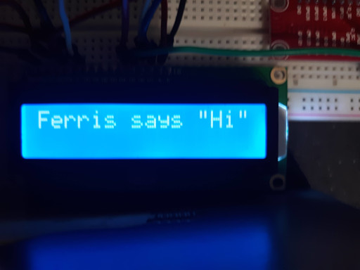

# hd44780_ntb

This is an implementation of a hardware driver for a [HD44780] type LCD
controller write in [Rust] which uses the [linux-embedded-hal] library.
It exposes a simple trait-based API for the command set which minimizes the
coupling between the hardware driver (GPIO, I2C, etc) and the code that passes
commands and data to the display.

## Table Of Contents

  * [Getting Started](#getting-started)
  * [Using The Crate](#using-the-crate)
  * [Examples](#examples)
  * [Contributing](#contributing)
  * [Licenses](#licenses)

## Getting Started

You will need to have a recent version of [Rust] installed.
Any version of Rust that supports version 0.2 or later of the
[linux-embedded-hal] should work but versions from 1.39 to 1.45 of Rust have
been used during initial development on both the nightly and release channels.
Earlier versions might work as well but have not been tested.

Development can be done on an OS (GPIO, I2C, etc) that Rust supports but the
expected target would typically be something like a Raspberry Pi, STM32, or
another embeddable system which can run Linux.
All initial development has been done with a combination of a laptop running
Windows 10 and a 4GB Raspberry Pi 4 running the Raspberry Pi OS (Raspbian).

### Using The Crate

To use the crate in your own project all you need to do is include it in
`[dependencies]` of you project like you would any other crate.
If you have [cargo-edit] install then on the command line you can use:

```shell script
cargo add hd44780-ntb
```

Which should add something like this in your [Cargo.toml]:

```toml
[dependencies]
hd44780-ntb = "0.0.5"
```

## Examples

<picture>
    <source media="(min-width: 4128px)" srcset="media/hi_ferris.jpg">
    <source media="(min-width: 2048px)" srcset="media/hi_ferris2048.jpg">
    <source media="(min-width: 1024px)" srcset="media/hi_ferris1024.jpg">
    <source media="(min-width: 512px)" srcset="media/hi_ferris512.jpg">
    
</picture>
<br>

You will find examples in the `examples` directory. The Raspberry Pi GPIO
examples were used for testing during initial development on a RPi 4.

Here's a short clip from a run of the rpi4bit example:

<video width="640" controls>
    <source src="https://drive.google.com/open?id=1AmDToIt7GqLQJ8HaOB1L77cYCYlXot8o" type="video/mp4">
    Your browser does not support any of the available video format of this video.
</video>
<br>

To build this example start by clone this project somewhere on your Raspberry
Pi:

```shell script
git clone https://github.com/Dragonrun1/hd44780_ntb
```

Next execute the follow to build the example:

```shell script
cargo build --example rpi4bit
```

And finally execute:

```shell script
sudo ./target/debug/examples/rpi4bit
```

You should see the series of messages displayed in the terminal and on your LCD
if it has been hooked up using the same GPIO pins that the example expects.

## Contributing

Contributors are welcome.
I would like to see the hardware drives extended beyond just the Raspberry Pi
but I currently don't have access to other hardware for development or testing.
Make sure you have read the [Contributor Covenant Code of Conduct].
All contributed code will be considered to also be contributed under a [MIT]
license.
Please include your information in a comment on all code files for the copyright
etc.

All contributed documentation or non-code text like this README etc. will be
consider to be under the same [CC-BY-SA] license.

## Licenses

All code is available under the [MIT] license.
You can find a copy of the license in the [LICENSE] file.

All documentation like this README is licensed under a
<a rel="license" href="http://creativecommons.org/licenses/by-sa/4.0/">Creative Commons Attribution-ShareAlike 4.0 International License</a>
(CC-BY-SA). 

[Cargo.toml]: https://doc.rust-lang.org/cargo/guide/dependencies.html
[CC-BY-SA]: http://creativecommons.org/licenses/by-sa/4.0/
[Contributor Covenant Code of Conduct]: CODE_OF_CONDUCT.md
[cargo-edit]: https://crates.io/crates/cargo-edit
[crates.io]: https://crates.io/search?q=hd44780
[HD44780]: https://en.wikipedia.org/wiki/Hitachi_HD44780_LCD_controller/
[hd44780-driver]: https://crates.io/crates/hd44780-driver
[LICENSE]: LICENSE
[linux-embedded-hal]: https://github.com/rust-embedded/linux-embedded-hal
[MIT]: https://opensource.org/licenses/MIT
[Rust]: https://www.rust-lang.org/

<hr>
<a rel="license" href="http://creativecommons.org/licenses/by-sa/4.0/">

</a>
